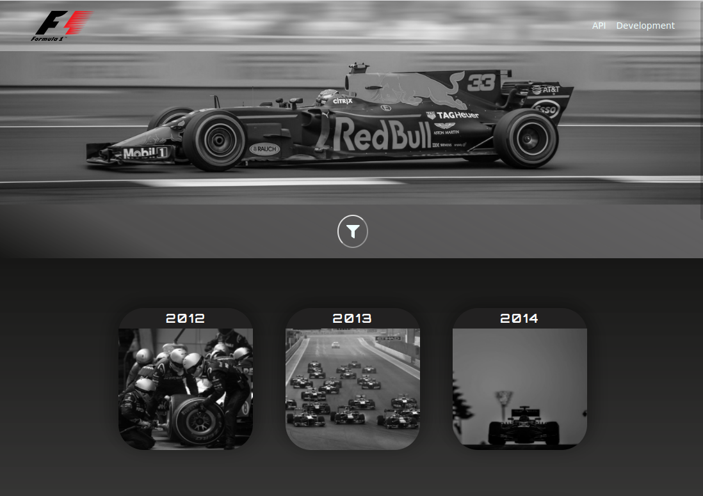

<p align="center">
  <a href="https://f1catalogue.netlify.app">
    
  </a>
</p>
<br>

<h3 align="center">

  **FORMULA 1 CATALOGUE**

</h3>

<p align="center">
  <strong>Web App created by Thales Neves</strong>
  <br>
  Project created using <a href="https://rapidapi.com">Rapid API</a> and <a href="https://reactjs.org">React</a> & <a href="http://redux.js.org">Redux</a>
</p>

<p align="center">
  <a href="https://f1catalogue.netlify.app">
    
  </a>
</p>

<p align="center">
  <a href="https://github.com/thneves/FormulaOne-Catalogue/issues">
    
  </a>
   ‎ ‎ ‎ ‎
  <a href="https://github.com/thneves/FormulaOne-Catalogue/issues">
    
  </a>
</p>

## Table of Contents
- [🚀 About Formula 1 Catalogue](#🚀-about-formula-1-catalogue)
- [⚒️ Built With React & Redux](#⚒️-built-with-react-&-redux)
- [🟢 Live Demo](#🟢-live-demo)
- [🖥️ Setup](#🖥️-setup)
  - [Requirements](#requirements)
  - [Installation](#installation)
  - [API KEYS](#api-keys-and-env-variables)
  - [Run The Project](#run-the-project)
  - [Tests](#testing-code)
- [👤 Author](#👤-author)
- [🤝 Contributing](#🤝-contributing)
- [⭐ Show your support](#⭐-show-your-support)


## 🚀 About Formula 1 Catalogue

[**F1 Catalogue**](https://f1catalogue.netlify.app) is a web app where you can find the top 8 drivers ranking of the last Formula 1 seasons. The ranking display info about each driver on the season, including the driver picture and team. It was build with React & Redux and [Rapid API](http://rapidapi.com) to retrieve all the necessary information.

<br>

## 🧪 Built With React & Redux

[React](https://reactjs.org)

[Redux](http://redux.js.org)

[Netlify](https://netlify.com)

[Axios](https://axios-http)

[Rapid API](https://rapidapi.com)

[Yarn](https://yarnpkg.com)

<br>

## 🟢 Live

<h3>

  [Formula One Catalogue](https://f1catalogue.netlify.app)

</h3>

<a href="https://f1catalogue.netlify.app">
  
</a>

<br>
<br>
<br>

## 🖥️ Setup

### Requirements

Internet Browser

[Git](https://git-scm.com/downloads) for version control.

[Node.js](https://nodejs.org) to install dependencies and run scripts via `yarn`.

### Installation

Open the terminal inside a folder of your choice and clone this repository using the following [Git](https://git-scm.com/downloads) commands in the terminal:

```
    git clone https://github.com/thneves/FormulaOne-Catalogue.git
```

Then, enter the project folder using:

```
    cd FormulaOne-Catalogue
```

To be able to run the web app you need to install Node dependencies by typing the following command on your terminal:

```
    yarn install
```

Done!

### API KEYS and ENV variables.

Go to [Rapid API](https://rapidapi.com/api-sports/api/api-formula-1/) create and account and get your own Formula 1 API Key,

To be able to create your own environmental variables you need to create a `.env` file in the root of the project.

You need to name the variable with the follow prefix `REACT_APP_`.

Like so

```
  // .env

  REACT_APP_API_KEY=3281772
```
Now you're ready to start the project
### Run The Project

Now that you've installed the repository and have the api key. Type the following to start the project:

```
    yarn start
```

This command will open a `localhost:3000` server where it will be running the web app, you can close the server using CTRL + C.


### Testing Code

To check all the test coverage made in the project application run the following command:

```
    yarn test
```


**Enjoy!**

## 👤 Author

 **Thales Neves**

- Github: [thneves](https://github.com/thneves)
- Twitter: [@tsneves11](https://twitter.com/tsneves11)
- LinkedIn: [Thales Neves]([(https://www.linkedin.com/in/thales-neves10/))

## 🤝 Contributing

Contributions, issues, and feature requests are welcome!

Feel free to check the [issues page](https://github.com/thneves/FormulaOne-Catalogue).

## ⭐ Show your support

Give a ⭐️ if you like this project!